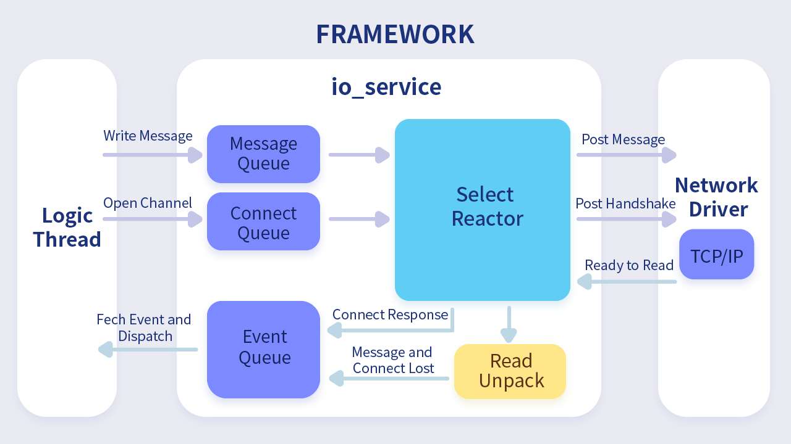

<p align="center"><a href="https://yasio.github.io/yasio" target="_blank" rel="noopener noreferrer"></a></p>

# *YASIO* - *Y*et *A*nother *S*ocket *I*/*O* library.

[](../../releases/latest)
[](https://996.icu)
[](https://github.com/yasio/yasio/blob/master/LICENSE)
[](https://github.com/yasio/yasio)
[](https://github.com/yasio/yasio)
[](https://github.com/yasio/yasio/actions?query=workflow%3Acodeql)  
  
[](https://www.bytedance.com/)  
  
**[简体中文](README.md)**
  
**yasio** is a multi-platform support and lightweight library with focus on asynchronous socket I/O for any client application, support windows, macos, ios, android, linux, freebsd and other unix-like systems.

## Supported Platforms

| Build | Status (github) |
|-------|-----------------|
| Windows(msvc,clang,mingw)|[](https://github.com/yasio/yasio/actions?query=workflow%3Awindows)|
| Windows(vs2013)|[](https://ci.appveyor.com/project/halx99/yasio)|
| Android|[](https://github.com/yasio/yasio/actions?query=workflow%3Aandroid)|
| iOS/tvOS/watchOS|[](https://github.com/yasio/yasio/actions?query=workflow%3Aios)|
| Linux |[](https://github.com/yasio/yasio/actions?query=workflow%3Alinux)|
| macOS |[](https://github.com/yasio/yasio/actions?query=workflow%3Aosx)|
| FreeBSD |[](https://github.com/yasio/yasio/actions?query=workflow%3Afreebsd)|
| Solaris |[](https://github.com/yasio/yasio/actions?query=workflow%3Asolaris)|

## Showcase

* [Place Girls](http://hcsj.c4connect.co.jp/): A popular mobile game published on jp.
* [RAOL Mobile Game Project](https://hongjing.qq.com/): Since the game is published on Tencent Games at 2018.10.17, it's run at millions of devices.
* [x-studio IDE Project](https://en.x-studio.net/): The local LAN upgrade system is based on yasio.
* [QttAudio](https://www.qttaudio.com/): Integrated Audio solution.

## Integration Demos

* Unity
  - [yasio_unity](https://github.com/yasio/yasio_unity): The unity c# wrapper of yasio, open scene `SampleScene` and run it.
  - [xlua](https://github.com/yasio/xLua): Integrate yasio to xlua, open scene `U3DScripting` and run it.
* [xlua](https://github.com/yasio/xLua): 
* UnrealEngine
  - [yasio_unreal](https://github.com/yasio/yasio_unreal): The yasio UnrealEngine plugin
  - [sluaunreal](https://github.com/yasio/sluaunreal): Integrate to Tencent's sluaunreal(A lua bindings solution for UE4)
  - [UnLua](https://github.com/yasio/UnLua): Integrate to Tencent's sluaunreal(Yet another lua bindings solution for UE4)
* [axmol](https://github.com/axmolengine/axmol): Use as tcp/udp asynchronous socket solution of game engine `axmol`

## Docomentation

* [https://yasio.github.io/en](https://yasio.github.io/en)

## Simple run tcptest with g++

```sh
g++ tests/tcp/main.cpp --std=c++11 -DYASIO_HEADER_ONLY -lpthread -I./ -o tcptest && ./tcptest
```

## Build more examples with cmake

```sh
git clone --recursive https://github.com/yasio/yasio
cd yasio
# For macOS xcode, it's shoud be: cmake -B build -GXcode
cmake -B build

# Use cmake command to build examples & tests, or use platform specific IDE to open yasio project
# a. Windows: Use Visual Studio(2013~2019 supported) to open build/yasio.sln
# b. macOS: Use Xcode to open build/yasio.xcodeproj
cmake --build build --config Debug
```

## About new `build.ps1`

- Cross-platform, it can run on Windows, Linux, macOS
- All github ci actions use it
- Support options
  - `-p`: build target os: `win32`,`winuwp`,`linux`,`android`,`osx`,`ios`,`tvos`,`watchos`
  - `-a`: build arch: `x86`,`x64`,`arm`,`arm64`
  - `-cc`: c/c++ compiler toolchain: `clang`, `msvc`, `gcc` or empty use default compiler avaiable on current OS;  
    For msvc can be `msvc-120`, `mvsc-140`, `mvsc-160`
  - `-xc`: additional cmake options: i.e.  `-xc '-DCXX_STD=23','-DYASIO_ENABLE_EXT_HTTP=OFF'`

- Support build target matrix
  | OS        |   Build targets     |  Build toolchain     |
  |----------|----------------------|----------------------|
  | Windows  |  win32,winuwp        | msvc,clang |
  | Linux    | linux,android        | gcc,clang            |        
  | macOS    | osx,ios,tvos,watchos | clang                |

## Features: 

* Support TCP/UDP/KCP, and manipulate APIs are same
* Support process ```sticking packets``` for TCP internal, user do not need to care it
* Support multicast
* Support IPv4/IPv6 network
* Support multi-connections at one thread
* Support high-resolution deadline timer
* Support lua bindings
* Support cocos2d-x jsb
* Support [CocosCreator jsb2.0](https://github.com/yasio/inettester)
* Support [Unity3D](https://github.com/yasio/yasio_unity)
* Support [Unreal Engine](https://github.com/yasio/yasio_unreal)
* Support ssl client/server with OpenSSL/MbedTLS
* Support async resolve with c-ares
* Support header only with ```YASIO_HEAD_ONLY=1``` set at config.hpp or compiler flags
* Support Unix Domain Socket
* Support BinaryStram by **obstream/ibstream**, easy to use
* Support **7Bit Encoded Int/Int64** compatible with dotnet


## About some features of C++14/17/20 on C++11

yasio provide follow C++14/17/20 standard components compatible with C++11 compiler, please see: [yasio/string_view.hpp](yasio/string_view.hpp), [yasio/shared_mutex.hpp](yasio/shared_mutex.hpp), [yasio/memory.hpp](yasio/memory.hpp)

- cxx14::make_unique
- cxx17::string_view
- cxx17::shared_mutex
- cxx20::starts_with
- cxx20::ends_with

## Abount OpenSSL prebuilt (Windows)

The OpenSSL prebuilts are download from [buildware](https://github.com/axmolengine/buildware) and built by vs2022 msvc-14.36,
If your installed visual studio version less then vs2022, please pass `-DYASIO_SSL_BACKEND=2` to use `mbedtls` instead, i.e:

```bat
powershell build.ps1 -p win32 -a x64 -xc "'-DYASIO_SSL_BACKEND=2'"
```

## Core framework
  

